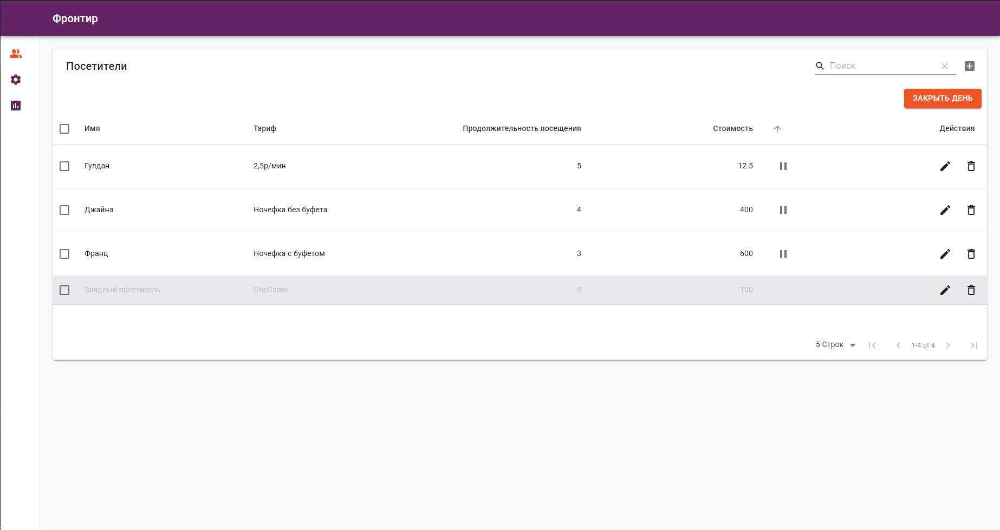
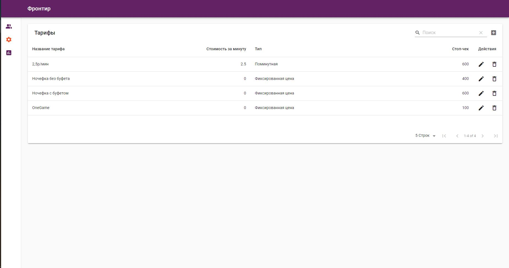
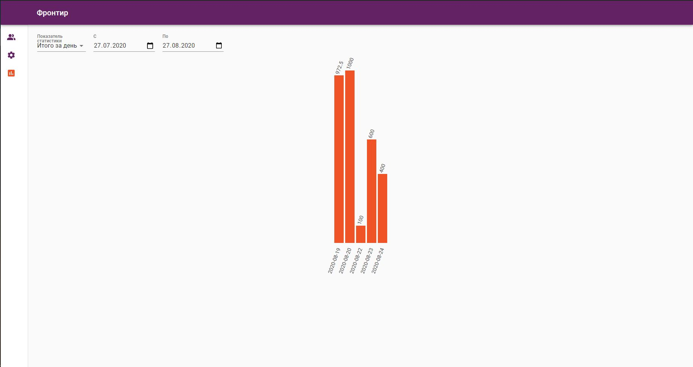

# Frontier
Anti-cafe visitor time control application

https://github.com/Momomash/Frontier

[Stryker Test Mutation](reports/mutation/html/index.html)

[Jest Test coverage](coverage/lcov-report/index.html)

Приложение по контролю времени посетителей антикафе

## Возможности

1). добавление, редактирование и удаление посетителей (валидация имени);

2). добавление, редактирование и удаление тарифов:

- фиксированная стоимость/ Стоимость за минуту;

- "стоп-чек".

3). постановка на паузу, воспроизведение и подсчет времени.

4). поддержка закрытия/обновления страницы браузера без потери данных.

5). возможность расчета нескольких посетителей одновременно с выводом итоговой суммы;

6). ведение архива записей с поддержкой статистики

7). формирование статистики за определенный период:

- Итого за день;

- Средняя стоимость посещения за день;

- Средняя продолжительность посещения за день;

- Количество человек в день.

## Используемые технологии:

- TypeScript

- React + Redux (Redux Toolkit)

- Material UI, Material Table + EmotionJS

- Redux-Persist + IndexedDB

